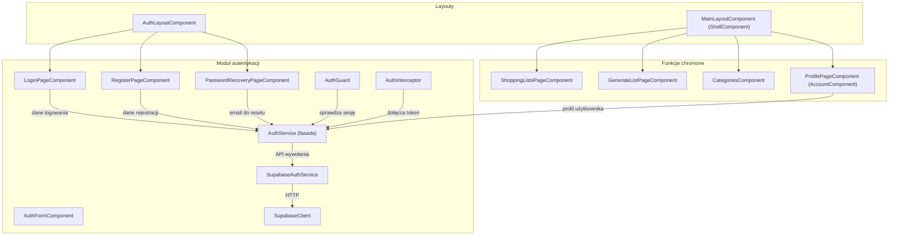

<architecture_analysis>

1. Wydzielone komponenty z dokumentacji i kodu:
   - AuthModule
   - AuthLayoutComponent, MainLayoutComponent (ShellComponent)
   - LoginPageComponent, RegisterPageComponent, PasswordRecoveryPageComponent, AuthFormComponent
   - AuthGuard, AuthInterceptor
   - AuthService (fasada), SupabaseAuthService, SupabaseClient
   - ProfilePageComponent (AccountComponent)
   - Komponenty chronione: ShoppingListsPageComponent, GenerateListPageComponent, CategoriesComponent
2. Główne strony i odpowiadające komponenty:
   - /auth/login → LoginPageComponent (zawinięty w AuthLayoutComponent)
   - /auth/register → RegisterPageComponent
   - /auth/recover → PasswordRecoveryPageComponent
   - / (po autoryzacji) → ShellComponent (MainLayoutComponent) z młotkami: lists, generate, categories, profile
3. Przepływ danych:
   - Formularze (Reactive Forms + Angular Material) przesyłają dane do AuthService
   - AuthService komunikuje się z SupabaseAuthService → SupabaseClient → Supabase Auth API
   - Sesja użytkownika przechowywana i emitowana w AuthService
   - AuthGuard odczytuje stan sesji z AuthService do ochrony tras
   - AuthInterceptor dołącza nagłówek Authorization do żądań chronionych
   - ProfilePageComponent wykorzystuje AuthService do pobrania i aktualizacji profilu
4. Krótkie opisy:
   - AuthLayoutComponent: uproszczony layout dla stron auth (formularze w centrum)
   - MainLayoutComponent/ShellComponent: toolbar, sidebar, obszar główny dla części chronionej
   - AuthGuard: kontrola dostępu do chronionych tras
   - AuthInterceptor: automatyczne dołączanie tokenu
   - Login/Register/Recover: formularze logowania, rejestracji, odzyskiwania hasła
   - AuthFormComponent: wrapper nad formularzami z mat-card i spinnerem
   - AuthService: fasada nad SupabaseAuthService, zarządzanie stanem sesji
   - SupabaseAuthService: komunikacja z Supabase Auth API
   - ProfilePageComponent: zarządzanie profilem użytkownika
   - Komponenty chronione: główne funkcjonalności aplikacji (listy, generowanie, kategorie)
     </architecture_analysis>

<mermaid_diagram>

</mermaid_diagram>
